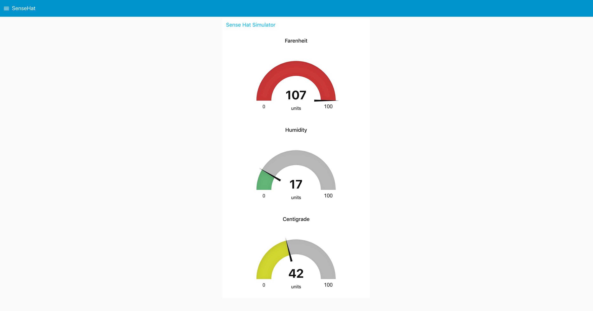
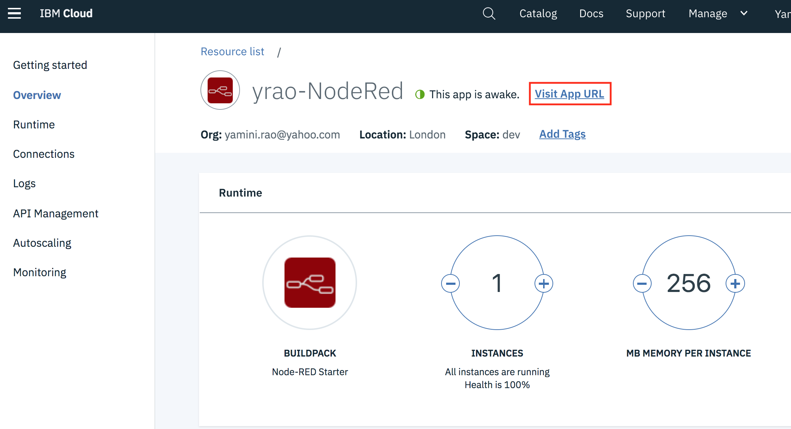
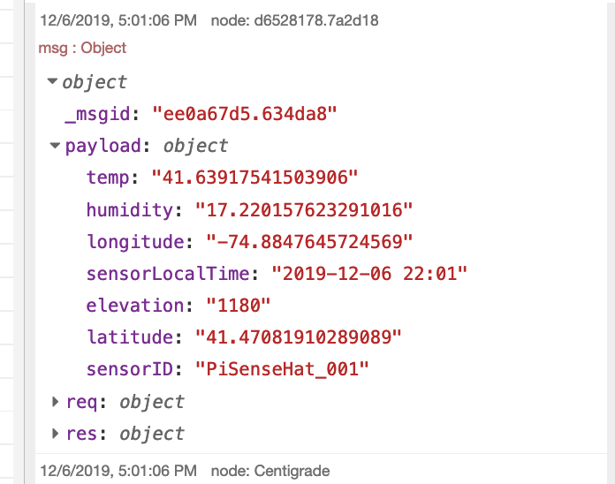

# Make a Simple Raspberry Pi Weather Dashboard Using IBM Cloud


## Introduction 
Node-RED is a wonderful tool that is used for prototyping and controling IoT devices.  Node Red is very easy to get started with and is a great tool for beginners who want to write and understand programming flow.

**In this lab we will be using Node-RED on IBM Cloud to build a temperature and humidity dashboard.** We will recieve temperature and humidity data from a Raspberry-Pi Sense hat and then use this data to create a dynamic real time dashboard that provides information about humidity and temprature in both farenheit, celsius. 

### In this workshop you will learn :

**(1)** The fundametals of Node-RED and IBM Cloud 

<details><summary><strong>Learn More</strong></summary>

[Node-RED](https://nodered.org/) is a visual tool for wiring the Internet of Things. It is easy to connect devices, data and API’s (services). It can also be used for other types of applications to quickly assemble flows of services.

Node-RED is available as open source and has been implemented bythe IBM Emerging Technology organization. Node-RED provides a browser-based flow editor that makes it easy to wire together flows using the wide range of nodes in the palette. Flows can be then deployed to the runtime in a single-click. While Node-Red is based on Node.js, JavaScript functions can be created within the editor using a rich text editor. A built-in library allows you to save useful functions, templates or flows for re-use.

Node-RED is included in the Node-RED starter application in [IBM Cloud](https://www.ibm.com/cloud) but you can also deploy it as a stand alone Node.js application. Node-RED can not only be used for IoT applications, but it is a generic event-processing engine. For example, you can use it to listen to events from http, websockets, tcp, Twitter and more and store this data in databases without having to program much if at all. You can also use it for example to implement simple REST APIs. You can find many other sample flows on the [Node-RED website](https://flows.nodered.org/).

</details>
 
**(2)** The fundamentals of working with the Raspberry-Pi Sense Hat 
<details><summary><strong>Learn More</strong></summary>
 
 The [Raspberry Pi](https://www.raspberrypi.org/) is a low cost, credit-card sized computer that plugs into a computer monitor or TV, and uses a standard keyboard and mouse. It is a capable little device that enables people of all ages to explore computing, and to learn how to program in languages like Scratch and Python. It’s capable of doing everything you’d expect a desktop computer to do, from browsing the internet and playing high-definition video, to making spreadsheets, word-processing, and playing games.

 In this lab we will be working with the Raspberry Pi as well as an accessory called the [Sense HAT Cape](https://projects.raspberrypi.org/en/projects/getting-started-with-the-sense-hat/3)

 The Sense HAT is an add-on board for the Raspberry Pi, made especially for the Astro Pi competition. The board allows you to make measurements of temperature, humidity, pressure, and orientation, and to output information using its built-in LED matrix.

 In this lab we will be using the Rasberry Pi and the Sense HAT to capture data on Temperature and Humidity which will then be displayed on a dashboard built on Node-RED on the IBM Cloud 
 
</details>

## Prerequisite : Create IBM Cloud Account 

In order to complete this workshop you will need to create an IBM Cloud account.  
1. [Sign up for an account here](https://ibm.biz/BdzgtA)
2. Verify your account by clicking on the link in the email sent to you


## Hardware Setup : 

The Raspberry Pi with the Sense HAT allows you to make measurements of temperature, humidity, pressure, and orientation, and to output information using its built-in LED matrix. We will use it to publish Temperature(Centigrade) and Humidity metrics to [Node-RED](https://nodered.org/) on the [IBM Cloud](https://cloud.ibm.com) - free account! It will also display the Temperature(Centigrade) to the matrix screen everytime your `cron` job runs

### Step 1 : 
* Setting up Raspbian on your Pi is easiest with [NOOBS](https://www.raspberrypi.org/documentation/installation/noobs.md)

### Step 2 : 
* setting up [Sense HAT](https://projects.raspberrypi.org/en/projects/getting-started-with-the-sense-hat)

### Step 3 : 
*  Open or ssh into your pi, then setup a cron job as root on Raspberry Pi with a SenseHat
```sh
#become root user
sudo su
touch /home/pi/sense.log
crontab -e
# add the following line to POST updates every 5 or any interval you like, I chose 5 minutes
echo "5 * * * * /usr/bin/python /home/pi/dev/pi-hat-node-red/push.py >> /home/pi/sense.log 2>&1"
# restart cron
systemctl restart cron

exit
#revert to pi user
mkdir -p /home/pi/dev && cd /home/pi/dev

#clone repo
git clone https://github.com/Grant-Steinfeld/pi-hat-node-red.git
cd pi-hat-node-red
ls
stat push.py
echo "push.py should be here"
```

## Node-RED Setup 
Once your hardware is set up , the next thing we are going to do is set up Node-RED on IBM Cloud. We will then use the Node-RED editor to create a flow to read the data coming from the Raspberry-Pi and the Sense HAT and display the data on a dashboard that looks like so : 




### STEP 1 : Run Node-RED using IBM Cloud 
1. Log in to your [IBM Cloud account](https://ibm.biz/BdzgtA)
2. Click on "Catalog" at the top-right corner
3. Search and select "Node-RED Starter" 
4. Give a unique name to your app and click "Create"
5. Once your app is created you'll be able to access it through the [resource list](https://cloud.ibm.com/resources)

Click the 'Visit App URL' option to access your Node-RED instance in your browser. (click next for the steps displayed until you see the option 'Go to your Node-Red Flow Editor', and select "Not recommended: Allow anyone to access the editor and make changes" for the second step. 




### STEP 2 : Working with the http input node 
 In the left navigation pane of the Editor you will see a lot of standard Node-RED nodes. 

 1. From the input category of nodes drag the `http` node and drop it on the editor pane.
> Single clicking on a dragged node lets you see the info for the node on the 'Info' tab on the right navigation pane. 
> Double clicking on the node lets you edit the node's properties. 
2. Double click on the http node to edit it's properties 
 * Set Method to Post 
 * Set url endpoint to `/sense-hat` 
 * Set name to `Sense-HAT POST` 

You should have this : 


### STEP 3: Connect http input to http output
1. From the output category of nodes , drag the `http-response` node into the editor. 
2. Drag a connection from the http input node and connect it with the http output node 
3. Double click on the output node and set: 
 * Status Code -> 200 
 * Add headers by clicking on the `+ add` button on the bottom 
 * Name the header key : `done` and header value : `OK-MRB` 
 4. You can also drag a debug node and connect it to the output of the input node to see the response once we connect the url to the raspberry pi 
 > Double click on debug node and set output to `complete msg object`

 You should have this : 


Basically what we are trying to do here is create a connection for the Raspberry Pi to send messages to. The way we can do this is by creating a POST request 

To test if the Raspberry Pi is successfully able to recieve messages from the PI : 

Take the url for your NodeRED instance and append the `/sense-hat` 

You should have something like this : 
```
https://<<yourNodeRedSubDomainname>>.mybluemix.net/sense-hat
```
> <<yourNodeRedSubDomainname>> is the name you gave your Node-RED instance. It can be found in the url of your Node-RED editor 

This is the url that we will then add to the `push.py` code which is used to capture the temperature and humidity data from the Sense HAT 

Once successfully connected you should be able to see the temperature and humidity in the debug panel. 



Congrats if you are able to see data in your debug panel! You can now move on to building a dashboard from this data! 

### * If you can not see data coming in from PI you can build a DATA Simulator *

1.  From the input category of nodes drag the `input` node and drop it on the editor pane.
2. Double click on the input node to edit it's properties 
* Set Payload to JSON 
* Copy JSON from [tempData.json](./tempData.json) and paste it into JSON input 
> this will act as the JSON temperature and humidity data coming from the pi 
* Name node `Sense-HAT Simulator` 
3. Connect the `Sense-HAT Simulator` node to debug node and deploy 
> Double click on debug node and set output to `complete msg object`

Now when you click on the inject button you should see the data that the sense hat would simulate. 


Congrats!You can now move on to building a dashboard from this data!


### STEP 4: Building the Temparature and Humidity Function 
In this step we will have to do some math to convert the temperature and humidity coming from the PI to Farenhe