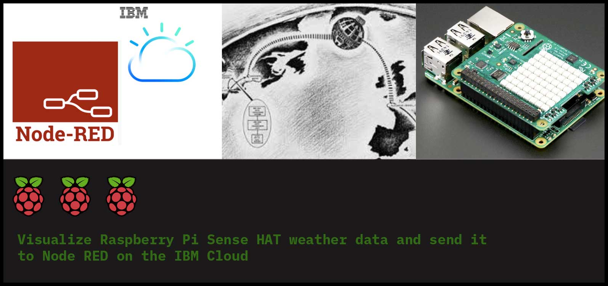

# Make a Simple Raspberry Pi Weather Dashboard Using IBM Cloud


## Introduction 
Node-RED is a wonderful tool that is used for prototyping and controling IoT devices.  Node Red is very easy to get started with and is a great tool for beginners who want to write and understand programming flow.

In this lab we will be using Node-RED on IBM Cloud to build a temperature and humidity dashboard. We will recieve temperature and humidity data from a Raspberry-Pi Sense hat and then use this data to create a dynamic real time dashboard that provides information about humidity and temprature in both farenheit, celsius. 

**In this workshop you will learn :**

**(1)** The fundametals of Node-RED and IBM Cloud 

<details><summary><strong>Learn More</strong></summary>

Node-RED is a visual tool for wiring the Internet of Things. It is easy to connect devices, data and API’s (services). It can also be used for other types of applications to quickly assemble flows of services.

Node-RED is available as open source and has been implemented bythe IBM Emerging Technology organization. Node-RED provides a browser-based flow editor that makes it easy to wire together flows using the wide range of nodes in the palette. Flows can be then deployed to the runtime in a single-click. While Node-Red is based on Node.js, JavaScript functions can be created within the editor using a rich text editor. A built-in library allows you to save useful functions, templates or flows for re-use.

Node-RED is included in the Node-RED starter application in IBM Cloud but you can also deploy it as a stand alone Node.js application. Node-RED can not only be used for IoT applications, but it is a generic event-processing engine. For example, you can use it to listen to events from http, websockets, tcp, Twitter and more and store this data in databases without having to program much if at all. You can also use it for example to implement simple REST APIs. You can find many other sample flows on the Node-RED website.
 
```text
* Low-code programming tool and framework for event-driven applications
* a Programming tool for wiring together hardware devices (e.g. IoT), APIs and online services in new and interesting ways
* provides a browser-based editor that makes it easy to wire together flows using the wide range of nodes in the palette that can be deployed to its runtime in a single-click.
```
> For in depth information take a look at the [ official Node-RED website https://nodered.org/](https://nodered.org/)

</details>
 
**(2)** The fundamentals of working with the Raspberry-Pi Sense Hat 
<details><summary><strong>Learn More</strong></summary>
 
 The [Raspberry Pi](https://www.raspberrypi.org/) is a low cost, credit-card sized computer that plugs into a computer monitor or TV, and uses a standard keyboard and mouse. It is a capable little device that enables people of all ages to explore computing, and to learn how to program in languages like Scratch and Python. It’s capable of doing everything you’d expect a desktop computer to do, from browsing the internet and playing high-definition video, to making spreadsheets, word-processing, and playing games.

 In this lab we will be working with the Raspberry Pi as well as an accessory called the [Sense HAT Cape](https://projects.raspberrypi.org/en/projects/getting-started-with-the-sense-hat/3)

 The Sense HAT is an add-on board for the Raspberry Pi, made especially for the Astro Pi competition. The board allows you to make measurements of temperature, humidity, pressure, and orientation, and to output information using its built-in LED matrix.

 In this lab we will be using the Rasberry Pi and the Sense HAT to capture data on Temperature and Humidity which will then be displayed on a dashboard built on Node-RED on the IBM Cloud 
 
</details>


## prerequisites
Raspberry Pi 2 or 3 - not sure about v4

[Sense HAT](https://www.adafruit.com/product/2738)

SSD card ( 8 or 16 Gb should be fine )

### The Sense HAT is an add-on board for the Raspberry Pi

The board allows you to make measurements of temperature, humidity, pressure, and orientation, 
and to output information using its built-in LED matrix.

We will use it to publish Temperature(Centigrade) and Humidity metrics to [Node-RED](https://nodered.org/) on the [IBM Cloud](https://cloud.ibm.com) - free account!

It will also display the Temperature(Centigrade) to the matrix screen everytime your `cron` job runs

## These instructions were run on a Raspberry Pi v3 and with the latest version of Raspbian OS 
* Setting up Raspbian on your Pi is easiest with [NOOBS](https://www.raspberrypi.org/documentation/installation/noobs.md)

## setup the Sense HAT
* setting up [Sense HAT](https://projects.raspberrypi.org/en/projects/getting-started-with-the-sense-hat)

## Open or ssh into your pi, then setup a cron job as root on Raspberry Pi with a SenseHat
```sh
#become root user
sudo su
touch /home/pi/sense.log
crontab -e
# add the following line to POST updates every 5 or any interval you like, I chose 5 minutes
echo "5 * * * * /usr/bin/python /home/pi/dev/pi-hat-node-red/push.py >> /home/pi/sense.log 2>&1"
# restart cron
systemctl restart cron

exit
#revert to pi user
mkdir -p /home/pi/dev && cd /home/pi/dev

#clone repo
git clone https://github.com/Grant-Steinfeld/pi-hat-node-red.git
cd pi-hat-node-red
ls
stat push.py
echo "push.py should be here"
```

### copy the contents of Pi-SenseHat-Ingress.Node-RED.json to your clipboard and paste into your node red editor and deploy it.

### Note your NodeRED endpoint POST URL and pass that as the first parameter to  push.py  

```sh
echo "example call"
python3 push.py https://<<yourNodeRedSubDomainname>>.mybluemix.net/<<your-end-point-path>>

#replace the values in the << >> with valid NodeRED path parts"
```

 
